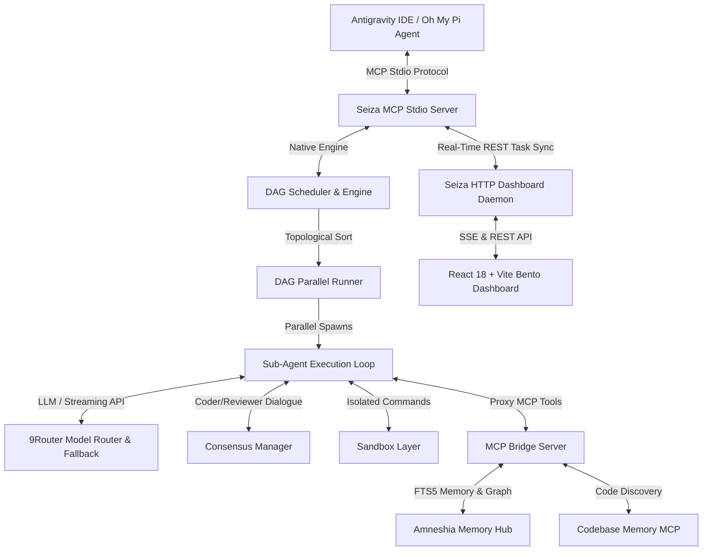

# 🌌 Seiza (星座)

[](https://github.com/SabilMurti/Seiza/actions)
[](https://opensource.org/licenses/MIT)
[](https://nodejs.org/)

> **Native TypeScript AI Orchestration Engine & MCP Server with Real-Time Bento Web Dashboard.**

Seiza acts as the high-performance execution layer for Head AI Architect agents (such as Antigravity IDE and Oh My Pi), coordinating specialized autonomous sub-agents (*Planner*, *Coder*, *Reviewer*, *Scout*, *Librarian*, *Tester*, *Designer*, *Security*) using OpenAI-compatible endpoints (e.g. **9Router**) with parallel DAG execution, multi-agent consensus validation, sandboxing, and interactive Human-In-The-Loop (HITL) authorization.

---



---

## ✨ Core Features

- ⚡ **DAG-Based Parallel Orchestration**: Automatically breaks complex coding prompts into topological dependency graphs and executes non-dependent steps in parallel.
- 🤝 **Multi-Agent Peer Review (Consensus Engine)**: Enforces automated Coder-Reviewer dialogue loops to verify diffs and safety before applying changes.
- 🔄 **Real-Time Cross-Process Task Sync**: Synchronizes task execution states across standalone Stdio MCP processes and the HTTP daemon via `POST /api/tasks/sync` and SSE streams.
- 🛡️ **Dynamic Model Router & Auto-Fallback**: Integrates with 9Router daemon. Automatically retries failing models (404/429/5xx) with zero-downtime exponential backoff fallback strategies.
- 🌉 **Universal Downstream MCP Bridge**: Seamlessly bridges tools from **Amneshia** (SQLite FTS5 Long-Term Memory Hub), **Codebase Memory MCP**, and **Context7**.
- 🔒 **Human-In-The-Loop (HITL)**: Intercepts destructive commands or tasks containing `#butuh-manusia`, pausing execution until approved via the Bento Web Dashboard.
- 📊 **Real-Time Bento Web Dashboard**: Premium React 18 + Tailwind UI featuring live DAG graphs, SSE streaming logs, agent directive editors, and token counters.
- 💾 **Context Inflation Shield**: Logs complete sub-agent execution trails into local SQLite (`sessions.db`) while returning concise abstractions to the parent agent.

---

## ⚡ Quick Start & Installation

### Option 1: Run Instantly (No Installation)
You can run Seiza directly via `npx` using the GitHub source:

```bash
# Run HTTP Web Dashboard & REST API
npx -y github:SabilMurti/Seiza --http --port 3456 --daemon
```

### Option 2: Global Installation
```bash
npm install -g github:SabilMurti/Seiza

# Start as HTTP Daemon
seiza --http --daemon
```

### Option 3: Standard MCP Server Setup (Stdio Mode)
Add Seiza to your MCP configuration file (`mcp_config.json` or `~/.omp/agent/config.yml`):

```json
{
  "mcpServers": {
    "seiza": {
      "command": "npx",
      "args": ["-y", "github:SabilMurti/Seiza"]
    }
  }
}
```

---

## 🛠️ MCP Tools Reference

Seiza exposes the following tools to parent agents:

| Tool Name | Description | Key Arguments |
| :--- | :--- | :--- |
| `run_seiza_task` | Executes a complex task using topological DAG scheduling. | `prompt`, `model`, `cwd`, `dag`, `skills` |
| `run_single_agent` | Runs a targeted autonomous sub-agent directly. | `agentName`, `prompt`, `model`, `cwd`, `skills` |
| `list_seiza_agents` | Lists all available agent profiles and frontmatter specs. | *(none)* |
| `list_seiza_models` | Fetches available 9Router models and role assignments. | *(none)* |
| `get_task_status` | Retrieves real-time execution status of active tasks. | `taskId` (optional) |
| `list_seiza_skills` | Returns all installed skills. | *(none)* |
| `install_seiza_skill` | Installs a skill package from GitHub/local path. | `source` |

---

## 🔌 Advanced Task Synchronization (API)

Seiza automatically synchronizes execution status across processes using:

- **`POST /api/tasks/sync`**: Used by Stdio MCP processes to stream live status updates to the background HTTP daemon.
- **`GET /api/tasks`**: Fetches the aggregated state of all tasks for dashboard display.
- **SSE Events**: The dashboard daemon streams events (`task_started`, `task_completed`, `task_failed`) via `GET /sse`.

---

## 🛠️ Development & Building

```bash
# Install all dependencies (Backend + Dashboard)
npm install

# Full build (Backend + Dashboard)
npm run build:all
```

---

## 📄 License

MIT © Sabil Murti
