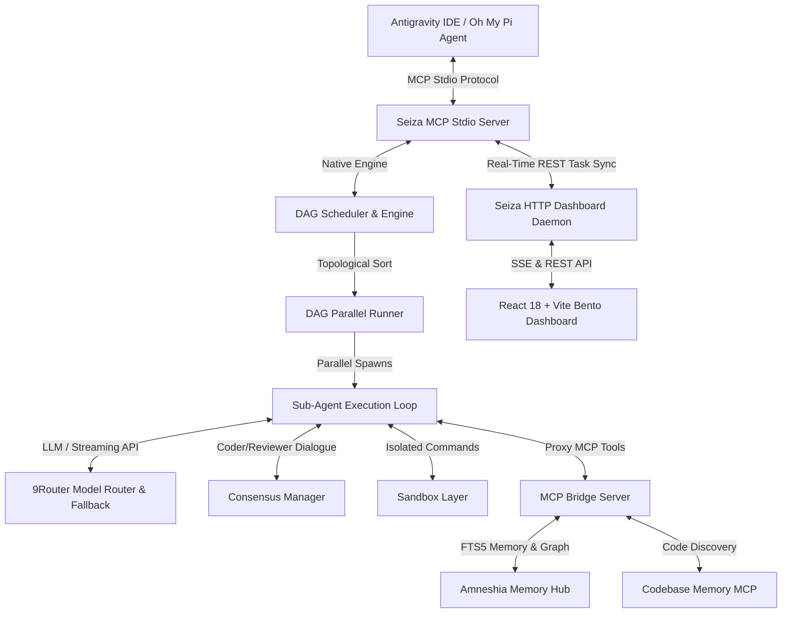

# 🌌 Seiza (星座)

[](https://github.com/SabilMurti/Seiza/actions)
[](https://opensource.org/licenses/MIT)
[](https://nodejs.org/)

> **Native TypeScript AI Orchestration Engine & MCP Server with Real-Time Bento Web Dashboard.**

Seiza acts as the high-performance execution layer for Head AI Architect agents (such as Antigravity IDE and Oh My Pi), coordinating specialized autonomous sub-agents (*Planner*, *Coder*, *Reviewer*, *Scout*, *Librarian*, *Tester*, *Designer*, *Security*) using OpenAI-compatible endpoints (e.g. **9Router**) with parallel DAG execution, multi-agent consensus validation, sandboxing, and interactive Human-In-The-Loop (HITL) authorization.

---



---

## ✨ Core Features

- ⚡ **DAG-Based Parallel Orchestration**: Automatically breaks complex coding prompts into topological dependency graphs and executes non-dependent steps in parallel.
- 🤝 **Multi-Agent Peer Review (Consensus Engine)**: Enforces automated Coder-Reviewer dialogue loops to verify diffs and safety before applying changes.
- 🔄 **Real-Time Cross-Process Task Sync**: Synchronizes task execution states across standalone Stdio MCP processes and the HTTP daemon via `POST /api/tasks/sync` and SSE streams.
- 🛡️ **Dynamic Model Router & Auto-Fallback**: Integrates with 9Router daemon. Automatically retries failing models (404/429/5xx) with zero-downtime exponential backoff fallback strategies.
- 🌉 **Universal Downstream MCP Bridge**: Seamlessly bridges tools from **Amneshia** (SQLite FTS5 Long-Term Memory Hub), **Codebase Memory MCP**, and **Context7**.
- 🔒 **Human-In-The-Loop (HITL)**: Intercepts destructive commands or tasks containing `#butuh-manusia`, pausing execution until approved via the Bento Web Dashboard.
- 📊 **Real-Time Bento Web Dashboard**: Premium React 18 + Tailwind UI featuring live DAG graphs, SSE streaming logs, agent directive editors, and token counters.
- 💾 **Context Inflation Shield**: Logs complete sub-agent execution trails into local SQLite (`sessions.db`) while returning concise abstractions to the parent agent.

---

## ⚡ Quick Start

### 1. Standard MCP Server Setup (Stdio Mode)

Add Seiza to your MCP configuration file (`mcp_config.json` or `~/.omp/agent/config.yml`):

```json
{
  "mcpServers": {
    "seiza": {
      "command": "wsl.exe",
      "args": [
        "-e",
        "env",
        "PATH=/home/murtix/.local/share/fnm/node-versions/v24.18.0/installation/bin:/usr/bin:/bin",
        "/home/murtix/.local/share/fnm/node-versions/v24.18.0/installation/bin/seiza"
      ]
    }
  }
}
```

### 2. Standalone HTTP Server & Web Dashboard

Run the server with the web dashboard enabled on port `3456`:

```bash
seiza --http --port 3456
```

Or run in background daemon mode:

```bash
seiza --http --daemon
```

Open your browser at `http://localhost:3456` to access the Seiza Web Dashboard.

---

## 🛠️ MCP Tools Reference

Seiza exposes the following tools to parent agents over standard MCP transports:

| Tool Name | Description | Key Arguments |
| :--- | :--- | :--- |
| `run_seiza_task` | Executes a complex task using topological DAG scheduling & sub-agent loops. | `prompt`, `model`, `cwd`, `dag`, `skills` |
| `run_single_agent` | Runs a targeted autonomous sub-agent directly. | `agentName`, `prompt`, `model`, `cwd`, `skills` |
| `list_seiza_agents` | Lists all available agent profiles and frontmatter specs. | *(none)* |
| `list_seiza_models` | Fetches available 9Router models and current role assignments. | *(none)* |
| `get_task_status` | Retrieves real-time execution status of active or completed tasks. | `taskId` (optional) |
| `list_seiza_skills` | Returns all installed skills in `./skills` or `~/.seiza/skills`. | *(none)* |
| `install_seiza_skill` | Installs a skill package from GitHub or a local directory path. | `source` |
| `list_bridge_tools` | Discovers tools exposed by connected downstream bridge servers. | `serverName` (optional) |

---

## 🔌 Downstream MCP Bridge Integration

Seiza can proxy tools from downstream MCP servers directly into sub-agent execution loops:

- **Amneshia**: Zero-external-DB SQLite FTS5 long-term memory hub & knowledge graph.
- **Codebase Memory MCP**: Graph-based structural code discovery, Cypher queries, and trace paths.
- **Context7**: Official up-to-date documentation engine for modern frameworks.

Manage bridge servers dynamically in the dashboard under the **Bridge** tab or in `~/.seiza/config.json`.

---

## 💻 CLI Options

```bash
seiza [options]

Options:
  -V, --version        output the version number
  --data-dir <path>    custom data directory (default: "~/.seiza")
  --http               enable HTTP/SSE server mode (default: true)
  --no-dashboard       disable HTTP Web Dashboard server
  -p, --port <number>  port number (default: 3456)
  -d, --daemon         run server in background daemon mode (default: false)
  -h, --help           display help for command
```

---

## 🛠️ Development & Building

```bash
# Install root dependencies
npm install

# Typecheck and build backend
npm test
npm run build

# Build Web Dashboard
cd dashboard
npm install
npm run build
```

---

## 📄 License

MIT © Sabil Murti
