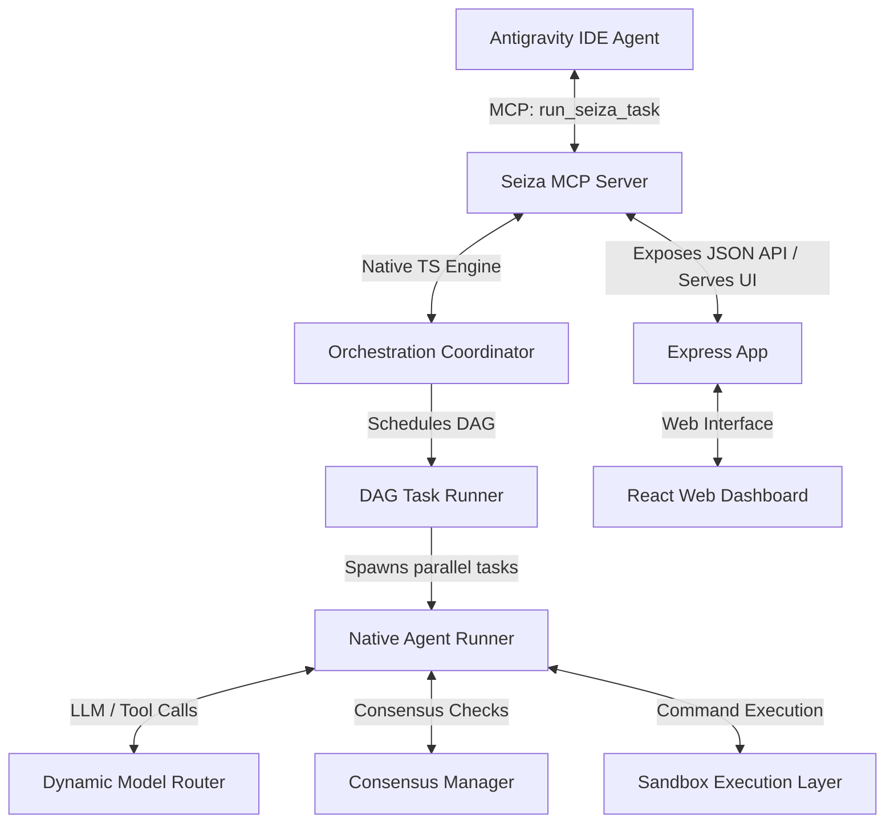

# 🌌 Seiza (星座)

Seiza is a custom, lightweight, and native TypeScript AI Orchestration engine running as an MCP server with a premium web dashboard. It acts as the execution layer for Head Project Manager agents (like Antigravity IDE), coordinating specialized sub-agents (Planner, Coder, Reviewer) using OpenAI-compatible APIs (like 9Router) with parallel DAG execution, sandboxing, and interactive human-in-the-loop validation.



---

## ⚡ Quick Start

### 1. Direct Run via GitHub
You can run Seiza instantly from GitHub without installing anything:

```bash
# Run HTTP Web Dashboard & REST API in background daemon mode
npx -y github:SabilMurti/Seiza --http --port 3456 --daemon
```

Or install globally via GitHub:

```bash
npm install -g github:SabilMurti/Seiza

# Run in background daemon mode anywhere:
seiza --http --daemon
```

### 2. Stdio Mode (Standard IDE Integration)
To connect Seiza to your editor/agent environment (e.g., Cursor, Antigravity IDE, Claude Code), add the server entry in your MCP config (`mcp_config.json`):

```json
{
  "mcpServers": {
    "seiza": {

      "command": "npx",
      "args": ["-y", "github:SabilMurti/Seiza"]
    }
  }
}
```

---

## 🔌 Bridging Downstream MCP Servers

Seiza can proxy tools from other downstream MCP servers, allowing native agents to access external systems seamlessly.

Recommended bridge presets:
- **Amneshia Memory Hub**: Long-term SQLite FTS5 memory hub & Knowledge Graph.
- **Codebase Memory MCP**: Cypher queries, graph discovery, and structural traces of your code.
- **Context7 Documentation API**: Up-to-date documentation and code examples for modern frameworks.

To add these, open the Seiza Dashboard and navigate to the **Bridge** tab to quick-add them via the presets.

---

## 🌟 Core Features

1. **DAG-Based Parallel Task Splitting**: Breaks down complex coding tasks into a Directed Acyclic Graph (DAG) of dependencies and executes non-dependent tasks in parallel.
2. **Multi-Agent Consensus (Peer Review)**: Implements Coder-Reviewer debate loops to audit and verify changes before applying them.
3. **Dynamic Model Routing**: Routes queries dynamically to different models (e.g., cheap models for scouting, flagship models for coding/reviewing) via 9Router.
4. **Sandboxed Execution**: Runs terminal commands and scripts inside an isolated local or Docker container environment to prevent host machine damage.
5. **Context Inflation Shield**: Logs verbose agent chat logs in a local SQLite database (`sessions.db`) and returns only abstract summaries to the parent agent.
6. **Human-in-the-Loop (HITL)**: Intercepts destructive commands or tasks tagged with `#butuh-manusia`, pausing execution for dashboard-based manual approval.
7. **Premium Bento UI Dashboard**: Interactive dark tech dashboard featuring live DAG visualization, real-time log streaming via SSE, config editors, and token counters.

---

## 🛠️ CLI Options

```bash
seiza [options]

Options:
  --data-dir <path>     Custom data directory (default: ~/.seiza)
  --http                Enable HTTP/SSE server mode (default: false)
  -p, --port <number>   Port number (default: 3456)
  -d, --daemon          Run server in background daemon mode (default: false)
  -h, --help            Display help details
```

---

## 📦 Project Structure

*   `src/index.ts`: CLI argument parser and daemon process fork manager.
*   `src/server.ts`: MCP Protocol Server + Express Web Application.
*   `src/core/dag.ts`: Topological sort scheduler and DAG runner.
*   `src/core/agent.ts`: Native agent execution loop.
*   `src/core/router.ts`: 9Router streaming client.
*   `src/core/consensus.ts`: Coder-Reviewer dialogue peer review.
*   `src/core/sandbox.ts`: Local and Docker sandboxing executors.
*   `src/core/abstraction.ts`: SQLite logging manager.
*   `agents/`: Declarative agent Markdown configurations.
*   `dashboard/`: React + Vite + Tailwind dashboard source code.

---

## 📄 License
MIT © Sabil Murti
